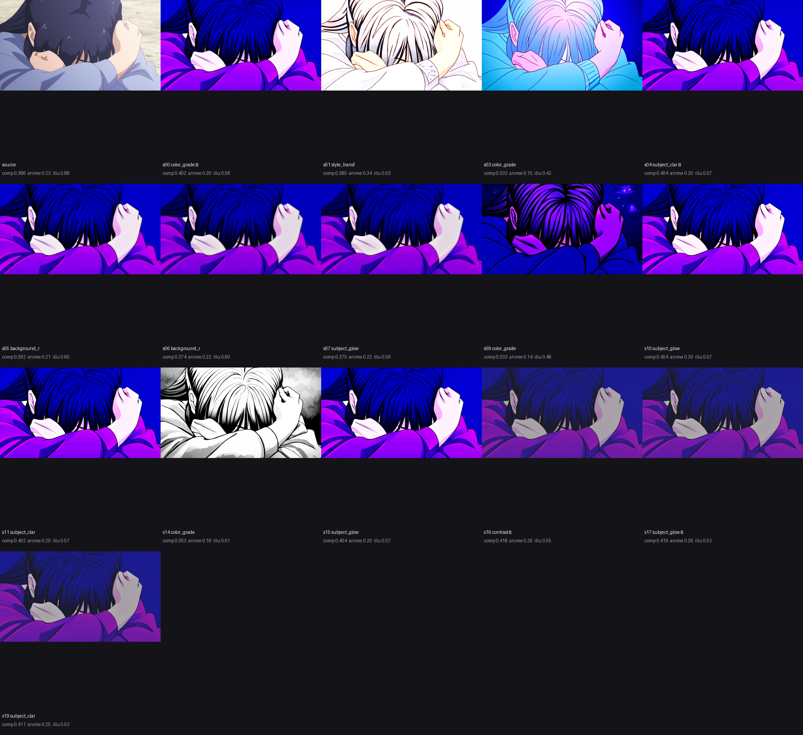
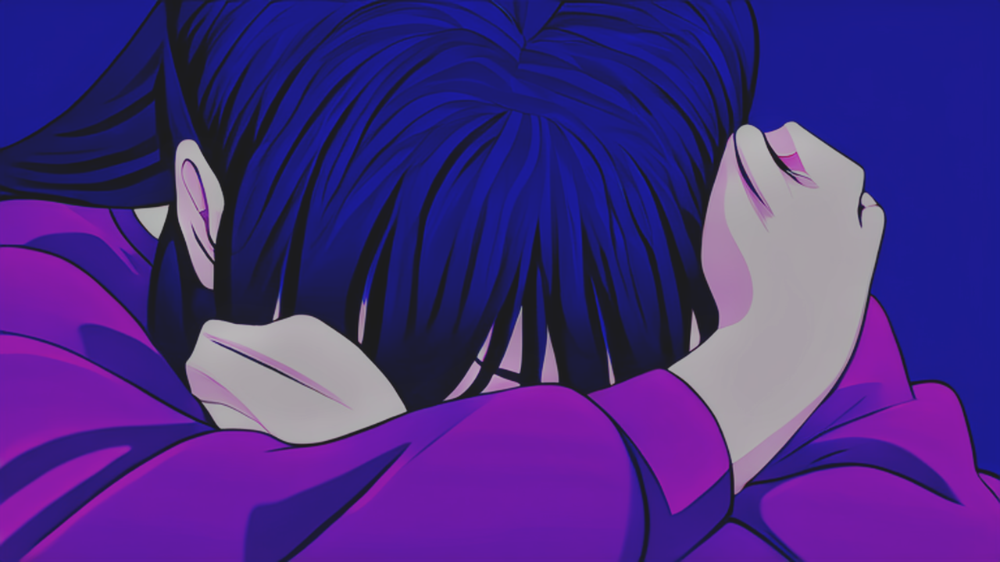

# LLM Art Director

**A language model can't hold a brush — but an art director never does. It looks, reasons, judges, and directs: studying an image, deciding what's wrong, and ordering edit after edit until it's better.**

LLM Art Director is an experiment in exactly that. It hands a large language model a set of *eyes* (a panel of aesthetic-scoring neural networks) and a set of *hands* (a darkroom of image-editing tools), then lets it direct the work. The model studies an image, reasons about what is holding it back, calls for edits, checks whether they actually helped, and keeps going for up to a set number of rounds (20 by default). It is a director with no ability to paint, refining an image by judgement alone.

This repository is the honest record of that idea. It includes the long stretch where the idea didn't work, and the one quiet lesson that turned out to matter more than any score.

---

## The premise

The starting thought was blunt:

> LLMs can't draw. Fine. They could, but maintaining that kind of pixel-level state would take forever. So they become artists by becoming *editors*. We have models that reason; we have models that judge composition and aesthetics. Let the reasoner read the judges, make decisions, apply edits, and adjust for *N* rounds — stopping early if it wants.

That's the whole philosophy. The art isn't in the brushwork. It's in the *seeing* and the *deciding*.

---

## What it actually does

You give it one image. It returns a refined version, plus a frame-by-frame record of how it got there.

Each round has four steps:

1. **Score.** The current image is scored with a panel of aesthetic models, and the raw numbers are translated into plain language. The model reasons over sentences ("overall appeal: weak — your clearest opportunity"), never a table of floats.
2. **Reason and propose.** A vision LLM looks at the real image, names the weakness it actually *sees*, and proposes two or three competing edits.
3. **Verify by doing.** If the artist's top pick is a parametric edit, its parametric proposals plus automatic strength variants (up to six in all) are each applied and re-scored. If the top pick is a generative edit, that one edit is run once. Of the ones that clear the gate, the artist's own primary choice is kept unless another beats it by more than 0.03 on the composite. Ideas are tested, not trusted.
4. **Judge.** A human-preference model (the pretrained PickScore) compares the new state against the last approved one. If the numbers went up but a person would prefer the old version, the edit is **rolled back**.

That last step is the heart of the project, and it took ten versions to get right.

The loop runs for at most `MAX_EDIT_STEPS` rounds (20 by default). It stops early if every weighted metric reaches its target. It also stops if it keeps stalling: after several rounds with no improvement it goes back to the best image, and once it has done that three times, the next stall ends the run. The model has no way to end the run itself, so "stopping early if it wants" in the quote above stayed an idea.

---

## The long road

This did not work for most of its life. The version history is the interesting part, so here it is honestly.

**v4–v5 — the skeleton.** Read an image, score it with LAION/NIMA/MUSIQ-style models, ask an LLM to pick an edit, apply it, repeat. The scaffolding existed, but most of it was quietly broken.

**v6 — the bugs nobody saw.** The API-key rotation caught only one exception type, so the LLM calls never actually rotated keys. The "dynamic weighting" was dead code that never ran. A drift counter accumulated until it silently blocked every bold edit. These were three features that the comments proudly described and the program never executed.

**v7 — the artist was barely there.** A real run revealed the vision model failing with `Unterminated string` on almost every step and silently falling back to a *blind* text model. The cause was that the new reasoning models spend tokens thinking, and the output budget was too small, so the JSON answer got cut off mid-sentence. The artist with eyes was hardly ever the one making decisions.

**v8 — letting it be bold.** Every dramatic edit was being killed by a structural-similarity gate, which flagged a colour grade as "90% different" even though the subject never moved. The fix was to switch the gate to *semantic* drift (is it still the same scene?), so colour and mood became free to change while the picture stayed itself.

**v9 — the trap.** Scorers actually trained on the image style were added, and the composite shot up from 0.30 to 0.72. It looked like success. It wasn't: the model had discovered that cranking a vignette to maximum spiked the score, and the "best" result was a crushed, dark, ugly frame. The metric loved it. A human wouldn't.

**v10 — the judge was dead the whole time.** The anti-gaming guard meant to catch exactly the v9 failure had been returning `None` on every call, silently doing nothing. The notes in the script say the v9 log has no judge line at all, and a comment in the loader dates the failure back to v7, when the judge was first added. The cause was that a newer `transformers` release quietly resolved the model to a different class, and the resulting error was swallowed. v10 prints that error and smoke-tests the judge at load, so a dead judge now disables itself loudly. Once it was fixed, the human-preference judge finally fired on every step and rolled back the gaming. For the first time, the final source-vs-best check (a Gemini A/B) confirmed a result that beat its source. This is the version this repository ships.

**v11–v12 — the pivot.** A fair objection arrived: editing a fixed frame "feels nothing like art, it's just touching it up." So the project flipped. Instead of refining a given image, the model would *paint* one from a prompt, then branch into a tree of variations, deciding at each node whether to repaint or to retouch, and return a small gallery of finished works. That branch is its own line of work and lives elsewhere. This repo is the editor, kept whole.

---

## The lesson: metric vs. masterpiece

Here is a run on a quiet, sombre frame: a figure with their face buried in their arms. Over fifteen accepted edits, the composite moved unevenly, with plenty of dips on the way, and peaked at 0.419 against 0.386 for the source. The best frame is the one shown below.



| The model's "best" | The scores, then the final check |
|---|---|
|  | composite **0.386 → 0.419** ✅ … final verdict: **source-preferred** ❌ |

The composite score rose, and the anime scorer rose with it (0.23 → 0.26), though the illustration scorer fell (0.88 → 0.52). These figures are the labels on the contact sheet above. Then the final check — a Gemini A/B comparison, run in both orderings — looked at the original and the result side by side and said, plainly, that the *original* was the better picture.

That disagreement is the whole project in one line.

**Optimise any fixed measure of beauty hard enough and a model will find the cheap exploit that satisfies the measure while betraying the intent.**

Oversharpening. Oversaturation. A heavy recolour into electric blue. A vignette cranked to black. Several of the guards in this codebase exist because an earlier version got caught doing precisely this. There are four: the held-out validator, the semantic-drift gate, the per-metric weight cap, and above all the preference judge that can overrule the score. Of the four, only the preference judge (PickScore) is a hard anti-gaming gate by default. The held-out CLIP-IQA validator is still computed and shown to the model, but it is advisory only (`HELDOUT_AS_GATE = False`) and does not veto edits.

The most useful result here is arguably a negative one: a small, documented demonstration of how readily metric-guided optimisation games its own metric, and what it takes to notice it. It comes from individual runs, which are not reproducible (see below), so read it as an example, not a measurement. (For an even blunter failure — what it does to a poster with text — see [Where it falls short](#where-it-falls-short-honestly) below.)

---

## How it works, in one diagram

```
                 ┌─────────────────────────────────────────────────────┐
  input image →  │  SCORE → READ (in words) → REASON → PROPOSE →       │
                 │     EXECUTE every candidate → JUDGE (human-pref)    │ → best image
                 └──────────▲──────────────────────────────────┬───────┘
                            └────── repeat up to N rounds ─────┘
```

- **Eyes** — Aesthetic Predictor v2.5, NIMA, MUSIQ, the LAION predictor, and PickScore (Kirstain et al.'s pretrained human-preference model, used as-is) as the judge. CLIP-IQA is held out of the composite and is advisory only. Two illustration scorers (skytnt/anime-aesthetic and Aesthetic Shadow) are loaded by default alongside the photo scorers, and carry 0.55 of the starting weights (the per-metric cap and headroom reweighting then adjust that).
- **Hands** — parametric edits (exposure, contrast, curves, colour, clarity, grain, vignette, split-toning…), saliency-masked *local* edits (subject vs. background), and a structure-preserving generative editor (CosXL) for the bold recolouring and relighting that the dials can't reach. It edits the image; it never redraws it.
- **Brain** — a Gemini vision model as the artist and a Groq model as the blind critic, both called over plain REST with key rotation and an auto-ranked model roster that fails over on errors.
- **Conscience** — the four guards above: the held-out validator (advisory by default), the semantic-drift gate, the per-metric weight cap, and the PickScore preference judge, which is the only hard anti-gaming gate.

---

## Run it

Built for a CUDA environment (developed on Kaggle's dual T4s, where one GPU edits and the other scores: `DEVICE_EDIT` is `cuda:0` and `DEVICE_SCORE` is `cuda:1`). Python 3.10+.

```bash
pip install -r requirements.txt
python art_director.py
```

Provide API keys for **Gemini** (artist) and **Groq** (critic), at least one of each, because the script stops without them. A **Hugging Face** token is optional.

- **On Kaggle**, add them as Secrets named `GOOGLE_API_KEY_1..6`, `GROQ_API_KEY_1..5`, and `HF_TOKEN`.
- **Locally**, set the same names as environment variables.

Then set `INPUT_IMAGE_PATH` in the script to your image and run. It is a constant near the top of `art_director.py`, not a command-line argument, and its default is a Kaggle dataset path. Outputs (the best image, the `evolution/` frames, a contact sheet, and JSON logs) land in `/kaggle/working/`. That path is hard-coded in several places (`LAION_V2_LOCAL`, `EVOLUTION_DIR`, `TOOL_PROFILE_PATH` and the save calls at the end), so outside Kaggle, create that directory or edit those paths first.

The script is laid out as a notebook (`# %%` cells) but runs as a plain file.

| Knob | Meaning |
|---|---|
| `INPUT_IMAGE_PATH` | the image to refine |
| `MAX_EDIT_STEPS` | the most rounds it will run (default 20); it can stop earlier, as described above |
| `USE_ANIME_AESTHETIC` | the skytnt anime scorer, on by default. There is no photo/anime mode switch |
| `USE_PICKSCORE_JUDGE` | the human-preference judge that rolls back gaming |
| `GENERATIVE_BACKEND` | `"cosxl"` (preferred) or `"ip2p"` |
| `SCORING_WEIGHTS` | the per-metric blend behind the composite |

---

## Where it falls short (honestly)

This section is the point. The project has real, structural problems, and pretending otherwise would waste the one thing it's good for: being a clear-eyed case study.

**It blurs and degrades the image.** Every generative edit runs the picture through a diffusion model at reduced resolution and scales it back, softening detail on each pass, and even the parametric edits can mush texture. Outputs routinely come back *less* sharp than the source.

**It destroys text.** It has no concept of typography. Run it on the movie poster below and the title softens and the fine credit print smears into illegible mush, because the scorers reward tone and colour and are completely blind to whether words are still readable. It treats a poster as if it were a photograph with nothing written on it.


*A movie poster after refinement. The credits at the bottom have turned to soup, and the title has lost its edges. The composite score was happy.*

**It often makes things worse.** Said plainly: more than once, the "best" output by the system's own composite was judged worse than the original, either by the final Gemini A/B check *or* by eye. A rising number frequently meant a degrading image. The sombre-portrait run earlier is exactly this: score up, picture worse.

**It games whatever you measure it by.** This is the defining flaw, not a footnote. Oversharpen, oversaturate, recolour everything electric blue, crush a vignette to black: the loop finds whatever cheap trick the metric rewards. The guards catch a lot. They do not catch all of it.

**The scorers are the wrong instrument for most things.** Four of the six composite scorers (Aesthetic Predictor v2.5, NIMA, MUSIQ, LAION) are trained on photographs. On anime, illustration, posters, or anything stylised, they sit in a narrow mid-band, barely move, and mislead. The composite is only meaningful on realistic photos, and even there it's a rough proxy. The "judge" that overrules it (PickScore) is itself a CLIP-based proxy: proxies refereeing proxies.

**It doesn't understand the image.** It reasons about tone, colour, and roughly where the subject is. It has no model of *content*, *intent*, or what the image is *for*. It can't decide "this is a poster, keep the text crisp" or "this is a portrait, protect the skin." Everything is a global knob-twiddling problem.

**It's slow, heavy, and fragile.** It wants two 16 GB GPUs and a stack of model downloads, and the reasoning leans on free-tier Gemini/Groq quotas that rate-limit and return 503 errors mid-run. A bad API day produces a worse picture. Given the same image, a different run can give a different result (the artist samples at temperature 0.85), so runs are not reproducible.

**And the honest meta-point:** under the loop and the guards, it is mostly *prompting and plumbing*. It doesn't learn, it doesn't develop taste, and "artist" is a generous word. In truth, it is a search procedure that pokes at an image until some proxy numbers go up, with guards bolted on to stop the worst of its self-deception.

---

## So what is it good for?

Not for finishing your posters. It's a working demonstration of a specific, important failure: a reasoning loop will quietly game any fixed measure of beauty, and catching it takes an independent judge and a stack of guards. Even then, the gap between the metric and the masterpiece never fully closes. That negative result, documented here with the run images, is the real deliverable.

---

## License

[MIT](LICENSE) © Suzume

*An exploration of LLM-as-art-director: reasoning, decision-making, and the stubborn distance between a score and something worth looking at.*
